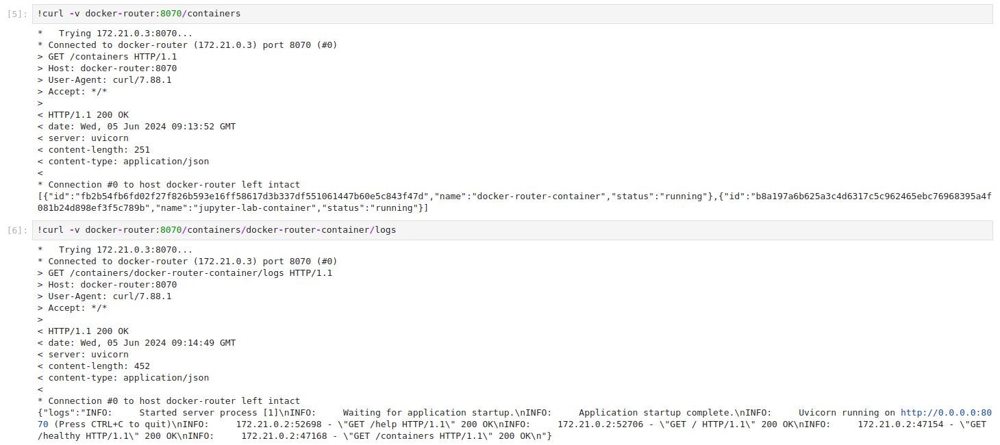

# Seamlessly Interact with Docker Containers from Your Host Machine Inside JupyterLab

## Open JupyterLab

```bash
docker compose up -d
```

Navigate to [localhost:8888/lab](localhost:8888/lab)

## Get Information About Docker Containers Inside JupyterLab

Use `curl` to monitor Docker containers:



Some endpoints:

- `docker-router:8070/help`: tell users what they can do.
- `docker-router:8070/containers`: list all containers.
- `docker-router:8070/containers/{container_name}/logs`: query the log file of the container.
- `docker-router:8070/containers/{container_name}/restart`: restart the container if neccessary.

You can add more routes and more functions inside [docker-router.py](docker-router.py) script. It is a FastAPI app.

## Cite

[Building RAG Agents with LLMs](https://resources.nvidia.com/en-us-ai-large-language-models/building-rag-agents-with-llms-dli-course?lx=Hh_Qnz)